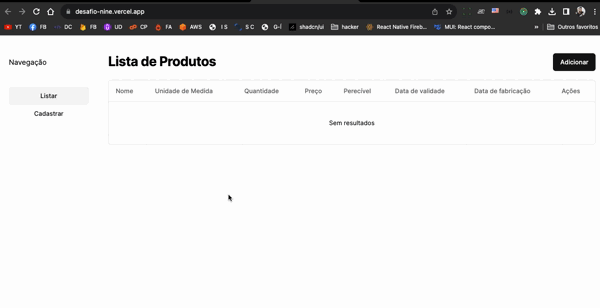

  <p align="center">
   
  </p>

  
<p align="center">
   
  </p>

# :clipboard: Sobre o projeto

Projeto realizado para teste de conhecimentos com programação web, uso de localstorage, mascara de campos por filtro de unidade de medida, responsividade e usabilidade.

1.Zustand
Usei zustand porque serve como uma alternativa otimizada para o React Context, pois ele não força renderização dos elementos pais (isso ocorre no react context devido ao provider englobando a aplicação)
Também o zustand possui um "middleware" pra persistência de dados diretamente no localStorage

2.Tailwind CSS
Necessário instalar como dependência da biblioteca de componentes (https://ui.shadcn.com/). É mostrado durante a criação/instação do projeto
npx create-next-app@latest my-app --typescript --tailwind --eslint

3.Eslint e Prettier
Duas ferramentas de desenvolvimento que todas as empresas usam para manter padrão de código entre os desenvolvedores que estão trabalhando naquele projeto, evitando erros, má práticas de código, entre outras vantagens.

4.NextJS
O projeto foi feito em NextJS pois é uma evolução do React convencional. Ele fornece uma renderização pelo lado do servidor, o que melhora o tempo de carregamento da página e das informações a serem mostradas, etc.
No caso os componentes são montados pelo lado do servidor, então não ocorre de executar o JavaScript para montagem no momento que é finalizado o download dos scripts pelo lado do cliente.

5.TypeScript
O TypeScript adiciona recursos avançados ao JavaScript, como a tipagem estática e interfaces, tornando mais fácil detectar e prevenir erros durante a fase de desenvolvimento. O TypeScript também torna o desenvolvimento de aplicativos em JavaScript mais fácil e seguro.

Abaixo podemos ver o resultado final do projeto. Espero que gostem!

<br>
<p align="center">
   
  </p>

# 🔗 Acesse o site com o link abaixo.

- [Desafio | Univiali](https://desafio-nine.vercel.app/)

- [Next.js](https://nextjs.org/)
- [Typescript](https://www.typescriptlang.org/)
- [Tailwind css](https://tailwindcss.com/)
- [Shadcn/ui](https://ui.shadcn.com/docs/installation/next)
- [Zustand](https://docs.pmnd.rs/zustand/getting-started/introduction)

## 🌐 Para iniciarlizar o projeto utilize o comando abaixo:

```bash

#Clonando o repositório do Github:
$ git clone https://github.com/willtechcod/Desafio-Univalle.git

#Ou Crie um novo projeto:
$ npx create-next-app@latest my-app --typescript --tailwind --eslint

#Acessar pasta Desafio-Univalle:
$ cd Desafio-Univalle

#Instalar alguns packages:

$ npx shadcn-ui@latest init  
$ npm install zustand 
$ npm install immer
$ 

#Inicializar pasta Desafio-Univalle:
$ npm run dev

```

##

<p align="center">
  
  </p>
